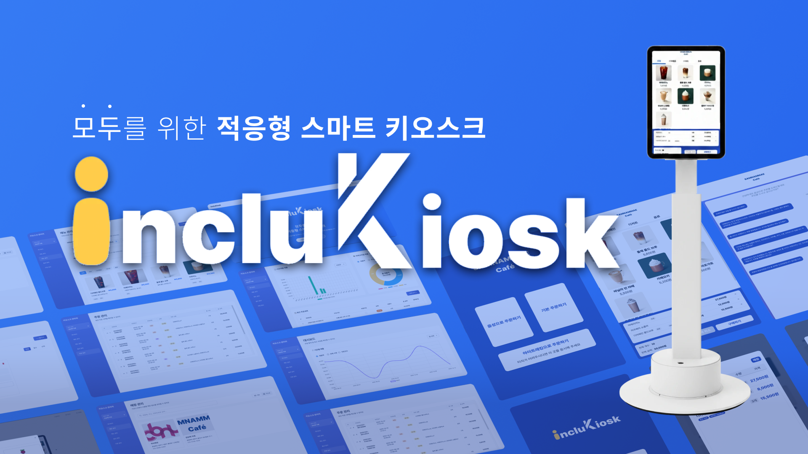
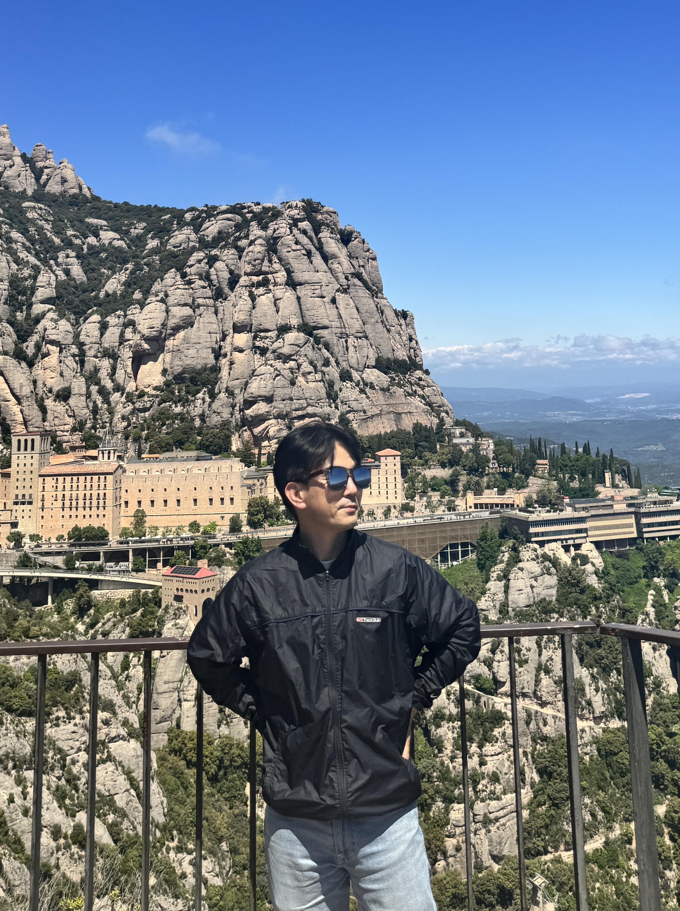
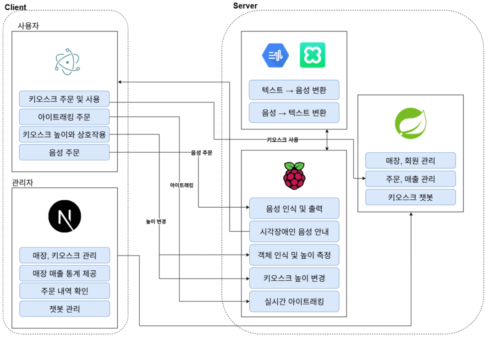
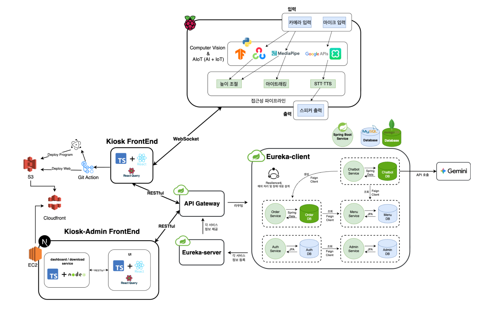
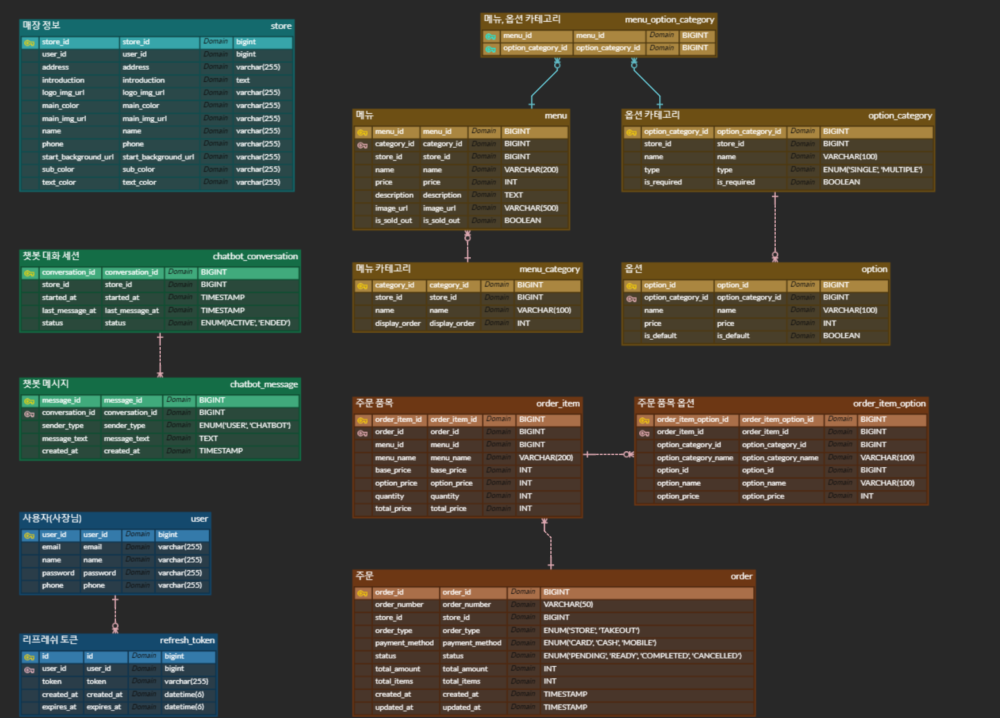
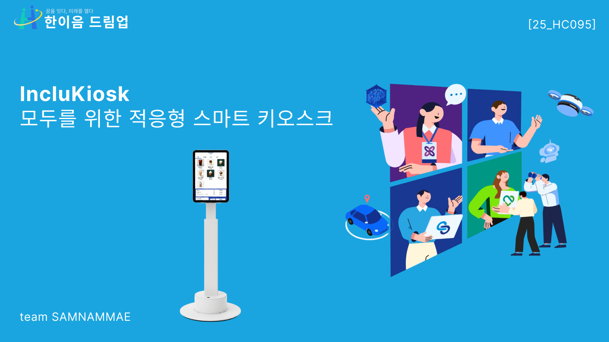

# IncluKiosk: 모두를 위한 적응형 스마트 키오스크



<br>

## 💡 1. 프로젝트 개요

### 1-1. 프로젝트 소개

- **프로젝트 명**: IncluKiosk
- **프로젝트 정의**: AI 기술(컴퓨터 비전, 시선 추적, LLM)을 활용하여 모든 사용자를 위한 **맞춤형 멀티모달 인터페이스**를 제공하는 포용적(Inclusive) 키오스크 시스템

### 1-2. 개발 배경 및 필요성

- **문제 인식**: 키오스크 보편화에 따른 디지털 격차 심화
  - 고정된 화면 높이와 터치 중심의 단일 방식으로 인해 특정 사용자층(휠체어 사용자, 노인, 시각장애인 등)의 이용이 어려움
- **사회적 요구**: 포용적 기술과 보편적 디자인에 대한 사회적 필요성 증대
- **프로젝트 목표**: 모든 사용자가 차별 없이 서비스를 이용하는 환경을 조성하여 디지털 소외 문제 해결

### 1-3. 프로젝트 특장점

- **사용자 자동 인식 및 화면 최적화**
  - 컴퓨터 비전으로 사용자 신장을 인식, 최적의 높이로 자동 조절
  - 사용자 상황에 맞는 맞춤형 UI 제공
- **다중 입력 방식을 지원하는 멀티모달 인터페이스**
  - 기본 터치 방식에 시선 추적(Eye-tracking) 및 음성 인식 기능 통합
  - 사용자가 자신에게 가장 편리한 입력 방식을 선택 가능
- **LLM 기반 지능형 대화 시스템**
  - 단순 명령어를 넘어, 문맥을 이해하는 자연어 처리 능력 확보
  - 메뉴 추천, 특정 성분 문의 등 복합적인 질문에 대한 대화형 응대 가능

### 1-4. 주요 기능

- **적응형 화면 높이 조절**: AI 기반 사용자 인식 및 화면 높이 자동 조절
- **아이트래킹 인터페이스**: 시선 움직임을 통한 메뉴 선택 및 제어
- **음성 챗봇**: LLM 기반 음성 주문 및 대화형 질의응답
- **다국어 지원**: 한국어, 영어, 중국어 등 다국어 인터페이스 제공
- **통합 아키텍처**: RESTful API 기반의 일관된 사용자 경험

### 1-5. 기대 효과 및 활용 분야

- **기대 효과**

  - **기술적 측면**: 멀티모달 AI 인터페이스로 고도화된 사용자 경험 제공
  - **사회적 측면**: 디지털 약자의 정보 접근성 및 자립도 향상을 통한 디지털 포용성 실현
  - **시장성**: 고령화 및 장애인 권익 확대에 따른 접근성 중심 키오스크 수요 충족

- **활용 분야**
  - **공공기관**: 민원 접수 및 안내 시스템
  - **의료기관**: 접수, 수납, 안내 시스템
  - **교통시설**: 발권 및 다국어 안내 시스템 (공항, 터미널 등)
  - **상업시설**: 주문 시스템 (카페, 식당 등)
  - **교육·문화시설**: 안내 및 예약 시스템 (도서관, 박물관 등)

### 1-6. 기술 스택

| 구분         | 기술                                                                                                                                                                          |
| ------------ | ----------------------------------------------------------------------------------------------------------------------------------------------------------------------------- |
| **FE**       | React.js, Next.js, TypeScript, react-query, zustand, Electron,                                                                                                                |
| **BE**       | Java, Spring Boot, Gemini API                                                                                                                                                 |
| **AI/ML**    | MediaPipe, OpenCV, PyCoral, TensorFlowLite, MobileNet-V2                                                                                                                      |
| **HW (IoT)** | Python, WebSockets                                                                                                                                                            |
| **DB**       | MongoDB, MySQL                                                                                                                                                                |
| **Cloud**    | AWS (EC2 · S3 · CloudFront · Route53)                                                                                                                                         |
| **HW**       | 라즈베리파이 4 Model B (8GB RAM), 라즈베리파이 카메라모듈 V2, <br> Seeed ReSpeaker Mic Array, 15.6인치 정전식 터치 디스플레이, <br> 리니어 액추에이터 및 TB6600 모터 드라이버 |

## 🧑🏻‍💻 2. 팀원 소개

<div align="center">

|                                     **정한울** (_[@jho7535](https://github.com/jho7535)_)                                      |                                  **강은송** (_[@kangeunsong](https://github.com/kangeunsong)_)                                   |                                **김도현** (_[@kdhqwe1030](https://github.com/kdhqwe1030)_)                                 |                                                          **김도영**                                                          |
| :----------------------------------------------------------------------------------------------------------------------------: | :------------------------------------------------------------------------------------------------------------------------------: | :------------------------------------------------------------------------------------------------------------------------: | :--------------------------------------------------------------------------------------------------------------------------: |
|  |  |  |  |
|                                                  • 백엔드 개발<br>• 서버 관리                                                  |                                                • 하드웨어 제어<br>• AI 기능 개발                                                 |                                             • 프론트엔드 개발<br>• UI/UX 설계                                              |                                                • 프로젝트 멘토<br>• 기술 자문                                                |

</div>

<br>

## 💡 3. 시스템 구성도

#### 🏗️ 전체 시스템 흐름도



<br>

#### 🧩 시스템 아키텍처



<br>

#### 🗂️ ERD



<br>

<br>

## 📽️ 4. 작품 소개영상

[](https://youtu.be/D_QDsTdd3jk)

<br>

<br>

## 💡 5. 핵심 소스코드

### 5-1. WebSocket 통신

- 라즈베리파이와의 WebSocket 통신을 통해 STT/TTS 흐름을 제어하고, 백엔드 REST API(ChatAPI) 를 통해 챗봇 대화를 처리하는 핵심 로직입니다.

```tsx
// [핵심 함수] Chat.tsx
// - sendMessage(): 프론트 → 라즈베리파이 명령 전송
// - chatAPI.sendChat(): 프론트 → 백엔드 챗봇 대화 요청
// - case 구문: 라즈베리파이 → 프론트로 수신되는 메시지 제어

useEffect(() => {
  if (!isConnected) return;

  const handle = async (msg: SocketMessage) => {
    switch (msg.type) {

      // 1️⃣ 안내 음성 종료 → STT 시작 (라즈베리파이로부터 수신)
      case "END_GUIDE":
        sendMessage({ type: "STT_ON" }); // 라즈베리파이에 음성인식 시작 명령
        setIsListening(true);
        break;

      // 2️⃣ 음성 인식 완료(STT_OFF) → 백엔드로 사용자 발화 전달
      case "STT_OFF":
        setChatLogs(prev => […prev, { message: msg.message, isBot: false }]);

        const res = await chatAPI.sendChat(shopId, {
          sessionId,
          message: msg.message,
          storeId: Number(shopId),
          storeName: shopName,
        });

        const answer = res?.aiMessage || "죄송합니다, 답변을 불러오지 못했습니다.";
        setChatLogs(prev => […prev, { message: answer, isBot: true }]);

        // 챗봇 응답을 라즈베리파이에 전달 → 음성 출력(TTS)
        sendMessage({ type: "TTS_ON", message: answer });
        break;

      // 3️⃣ 음성 출력 종료(TTS_OFF) → 다음 발화 대기
      case "TTS_OFF":
        sendMessage({ type: "STT_ON" }); // 다음 음성인식 시작
        setIsListening(true);
        break;
    }
  };

  addOnMessage(handle);
  return () => removeOnMessage(handle);
}, [isConnected]);
```

### 5-2. EdgeTPU 기반 실시간 사용자 추적

- EdgeTPU 하드웨어 가속과 2단계 폴백 전략(얼굴 → 사람)을 통해 사용자 위치를 실시간으로 추적하고, EMA 필터링으로 노이즈를 제거하여 **리니어 액추에이터 제어 함수(5-3)를 호출**하는 핵심 로직입니다.

```python
# height_worker.py - EdgeTPU 가속 객체 감지

# 1️⃣ EdgeTPU 모델 로드 (하드웨어 가속)
face_interpreter = tflite.Interpreter(
    model_path=FACE_MODEL,
    experimental_delegates=[tflite.load_delegate('libedgetpu.so.1')]
)
person_interpreter = tflite.Interpreter(
    model_path=PERSON_MODEL,
    experimental_delegates=[tflite.load_delegate('libedgetpu.so.1')]
)

# 2️⃣ 2단계 폴백 전략
def track_height():
    # 우선순위 1: 얼굴 감지 (정밀 제어)
    faces = detect_faces_ssd(face_interpreter, frame, MIN_DET_CONF)

    if faces:
        # 얼굴 중심을 화면 중앙으로
        y_center = (ymin + ymax) * 0.5
        ema_y = EMA_ALPHA * y_center + (1-EMA_ALPHA) * ema_y
        diff = ema_y - target_y

        if abs(diff) <= deadband:
            state = "center"  # ✅ 안정화
        elif diff < 0:
            moveUp(WITH_FACE)    # 빠르게 조절
        else:
            moveDown(WITH_FACE)

    else:
        # 우선순위 2: 사람 전체 감지 (대략적 위치)
        person = detect_person_ssd(person_interpreter, frame)

        if person:
            if person[1] <= 0.05:      # 화면 상단
                moveUp(WITHOUT_FACE)   # 천천히 조절
            elif person[1] >= 0.95:    # 화면 하단
                moveDown(WITHOUT_FACE)

# 3️⃣ EMA 필터로 노이즈 제거
ema_y = 0.3 * new_value + 0.7 * ema_y  # 부드러운 움직임

```

### 5-3. 리니어 액추에이터 정밀 제어 및 다중 안전장치

- **AI 비전 시스템(5-2)의 판단에 따라** GPIO 펄스 제어를 통해 스텝 모터를 정밀하게 구동하고, 다중 한계 검증과 실시간 높이 저장을 통해 하드웨어 안전성을 보장하며, 프로그램 종료 시 자동 원점 복귀를 수행하는 핵심 로직입니다.

```python
# linear_actuator_controller.py - 액추에이터 안전 제어

# 1️⃣ 한계 검증 (파일 기반 상태 관리)
def exceed_max_height() -> bool:
    """상한 초과 여부 판단"""
    global CUR_HEIGHT_STEP
    v = _read_height_from_file()  # current_height.txt 읽기

    if v is None:  # 파일 오류/범위 외
        print("[ACTUATOR] 🚫 높이 파일 오류. 이동 차단")
        return True

    CUR_HEIGHT_STEP = v  # 전역 상태와 동기화
    return CUR_HEIGHT_STEP >= HEIGHT_MAX  # 28000 step

def exceed_min_height() -> bool:
    """하한 초과(바닥) 여부 판단"""
    global CUR_HEIGHT_STEP
    v = _read_height_from_file()

    if v is None:
        print("[ACTUATOR] 🚫 높이 파일 오류. 이동 차단")
        return True

    CUR_HEIGHT_STEP = v
    return CUR_HEIGHT_STEP <= HEIGHT_MIN  # 0 step

# 2️⃣ 위로 이동 (확장) - 다중 검증
def moveUp(steps: int = DEFAULT_STEP):
    """액추에이터 위로 이동 (얼굴이 화면 아래에 있을 때)"""
    global CUR_HEIGHT_STEP

    # 첫 번째 검증: 이동 시작 전
    if exceed_max_height():
        print("[ACTUATOR] 🚫 최대 높이 도달, 이동 중단")
        return

    GPIO.output(DIR, GPIO.LOW)   # 위쪽 방향
    GPIO.output(ENA, GPIO.HIGH)  # 모터 활성화
    print(f"[ACTUATOR] ↑ Move UP {steps} steps (Current: {CUR_HEIGHT_STEP}/{HEIGHT_MAX})")

    # 매 스텝마다 펄스 + 재검증
    for _ in range(steps):
        # 두 번째 검증: 각 스텝마다
        if exceed_max_height():
            print("[ACTUATOR] 🚫 최대 높이 도달, 이동 중단")
            break

        # 펄스 신호 (스텝 모터 구동)
        GPIO.output(PUL, GPIO.HIGH)
        sleep(STEP_DELAY)  # 0.0004초
        GPIO.output(PUL, GPIO.LOW)
        sleep(STEP_DELAY)

        # 실시간 높이 추적 및 저장
        CUR_HEIGHT_STEP += 1
        _write_height_to_file(CUR_HEIGHT_STEP)

    print(f"[ACTUATOR] ↑ Current step: {CUR_HEIGHT_STEP}/{HEIGHT_MAX}")
    GPIO.output(ENA, GPIO.LOW)  # 모터 비활성화

# 3️⃣ 아래로 이동 (수축) - 다중 검증
def moveDown(steps: int = DEFAULT_STEP):
    """액추에이터 아래로 이동 (얼굴이 화면 위에 있을 때)"""
    global CUR_HEIGHT_STEP

    # 첫 번째 검증: 이동 시작 전
    if exceed_min_height():
        print("[ACTUATOR] 🚫 최소 높이 도달, 이동 중단")
        return

    GPIO.output(DIR, GPIO.HIGH)  # 아래쪽 방향
    GPIO.output(ENA, GPIO.HIGH)
    print(f"[ACTUATOR] ↓ Move DOWN {steps} steps (Current: {CUR_HEIGHT_STEP}/{HEIGHT_MAX})")

    for _ in range(steps):
        # 두 번째 검증: 각 스텝마다
        if exceed_min_height():
            print("[ACTUATOR] 🚫 최소 높이 도달, 이동 중단")
            break

        GPIO.output(PUL, GPIO.HIGH)
        sleep(STEP_DELAY)
        GPIO.output(PUL, GPIO.LOW)
        sleep(STEP_DELAY)

        CUR_HEIGHT_STEP -= 1
        CUR_HEIGHT_STEP = max(HEIGHT_MIN, CUR_HEIGHT_STEP)
        _write_height_to_file(CUR_HEIGHT_STEP)

    print(f"[ACTUATOR] ↓ Current step: {CUR_HEIGHT_STEP}/{HEIGHT_MAX}")
    GPIO.output(ENA, GPIO.LOW)

# 4️⃣ 프로그램 종료 시 자동 원점 복귀
def return_to_start():
    """현재 위치만큼 하강하여 기계 원점(0) 복귀"""
    global CUR_HEIGHT_STEP

    if CUR_HEIGHT_STEP <= 0:
        print("[ACTUATOR] Already at home position (0 step)")
        return

    print(f"[ACTUATOR] 🏁 Returning to home: {CUR_HEIGHT_STEP} steps down...")
    GPIO.output(ENA, GPIO.HIGH)
    GPIO.output(DIR, GPIO.HIGH)  # 하강 방향

    for i in range(CUR_HEIGHT_STEP):
        GPIO.output(PUL, GPIO.HIGH)
        sleep(STEP_DELAY)
        GPIO.output(PUL, GPIO.LOW)
        sleep(STEP_DELAY)
        _write_height_to_file(CUR_HEIGHT_STEP - i - 1)

        if i % 100 == 0 and i > 0:
            print(f"   ↓ 진행: {i}/{CUR_HEIGHT_STEP}")

    CUR_HEIGHT_STEP = 0
    _write_height_to_file(CUR_HEIGHT_STEP)
    GPIO.output(ENA, GPIO.LOW)
    print("[ACTUATOR] ✅ Returned to home position (step=0)")

def on_shutdown():
    """비정상 종료 시에도 원점 복귀 보장"""
    print("[SYSTEM] 🔻 Returning actuator to 0...")
    return_to_start()
    GPIO.cleanup()
    print("[SYSTEM] ✅ Actuator returned to home position.")

atexit.register(on_shutdown)  # 종료 훅 등록
```

### 5-4. PCA 기반 3차원 시선 추적

- PCA(주성분 분석)를 통해 얼굴의 3D 좌표계를 생성하고, 양안 시선 벡터를 융합하여 화면 좌표로 변환함으로써 고개 회전에도 정확한 시선 추적을 수행하는 핵심 로직입니다.
- 참고 오픈소스: https://github.com/JEOresearch/EyeTracker

```python
# eye_tracking_worker.py - 3D 기하학 기반 시선 추적

# 1️⃣ PCA로 얼굴 3D 좌표계 생성
def compute_coordinate_box(face_landmarks, indices, w, h):
    # 23개 코 랜드마크로 좌표계 구성
    points_3d = np.array([
        [face_landmarks[i].x * w,
         face_landmarks[i].y * h,
         face_landmarks[i].z * w]
        for i in nose_indices  # 23개 점
    ])

    # 주성분 분석으로 얼굴 회전 계산
    center = np.mean(points_3d, axis=0)
    cov = np.cov((points_3d - center).T)
    eigvals, eigvecs = np.linalg.eigh(cov)

    # 회전 행렬 생성 (얼굴의 방향)
    R_final = Rscipy.from_matrix(eigvecs).as_matrix()
    return center, R_final, points_3d

# 2️⃣ 양안 시선 벡터 융합
def track_gaze():
    # 좌우 눈의 시선 방향 계산
    left_gaze_dir = iris_3d_left - sphere_world_l
    right_gaze_dir = iris_3d_right - sphere_world_r

    # 두 눈의 평균으로 최종 시선 결정
    combined_direction = (left_gaze_dir + right_gaze_dir) / 2
    combined_direction /= np.linalg.norm(combined_direction)

    # 시선 방향 → 화면 좌표 변환
    screen_x, screen_y = convert_gaze_to_screen_coordinates(
        combined_direction,
        calibration_offset_yaw,   # 사용자별 보정값
        calibration_offset_pitch
    )

# 3️⃣ 사용자별 캘리브레이션
def calibrate():
    # 현재 눈 위치를 기준점으로 저장
    left_sphere_local_offset = R_final.T @ (iris - head_center)
    left_sphere_local_offset += base_radius * camera_dir_local

    # 화면 중앙을 보고 있다고 가정하고 오프셋 계산
    calibration_offset_yaw = -raw_yaw
    calibration_offset_pitch = -raw_pitch
```

### 5-5. LLM 기반 챗봇 응답 처리

- 사용자 발화를 받아 **Gemini LLM**을 통해 응답을 생성하고, **주문 요청**과 **일반 대화**를 구분하여 처리하는 백엔드 챗봇 서비스의 핵심 로직입니다. MSA 구조에 따라 주문 발생 시 **Order Service**와 통신합니다.

```java
// [핵심 로직] ChatService.processChat()
// - conversationRepository: 세션별 대화 기록 조회 및 저장
// - geminiPromptService: 메뉴 정보, 대화 히스토리 등을 조합하여 LLM 프롬프트 생성
// - geminiClient: Google Gemini API 호출
// - orderServiceClient: 주문 요청 발생 시 외부 Order Service API 호출

@Transactional
public ChatResponse processChat(Long storeId, String sessionId, String userMessage, String managedStoreIds, String storeName) {

    // 1️⃣ 대화 기록 조회 또는 생성 (세션 기반 대화 관리)
    Conversation conversation = conversationRepository.findBySessionId(sessionId)
            .orElseGet(() -> new Conversation(sessionId));

    // 2️⃣ 현재 사용자 메시지를 대화 기록에 추가
    conversation.addMessage(Message.of("USER", userMessage));

    // 3️⃣ Gemini에 보낼 프롬프트 생성 (시스템 프롬프트 + 메뉴 데이터 + 대화 히스토리)
    String prompt = geminiPromptService.createPrompt(storeId, conversation, managedStoreIds);

    // 4️⃣ Gemini API 호출하여 AI의 원본 응답 받기
    GeminiResponse geminiResponse = geminiClient.call(new GeminiRequest(prompt));
    String aiRawResponse = geminiResponse.extractText();

    // 5️⃣ AI 응답 분석 후 최종 메시지 결정
    String finalAiMessage;
    Optional<OrderRequestDto> orderRequestOpt = parseOrderAction(aiRawResponse, storeId, storeName);

    if (orderRequestOpt.isPresent()) {
        // 5-1. 주문 요청인 경우: Order Service 호출
        OrderRequestDto orderRequest = orderRequestOpt.get();

        try {
            var orderApiResponse = orderServiceClient.placeOrder(orderRequest);
            finalAiMessage = "주문이 완료되었습니다. 주문번호는 " + orderApiResponse.getData().getOrderNumber() + "입니다.";
        } catch (Exception e) {
            finalAiMessage = "주문 처리 중 오류가 발생했습니다. 다시 시도해 주세요.";
        }
    } else {
        // 5-2. 일반 대화인 경우: Gemini 응답 그대로 사용
        finalAiMessage = aiRawResponse;
    }

    // 6️⃣ 최종 AI 응답을 대화 기록에 저장
    conversation.addMessage(Message.of("AI", finalAiMessage));
    conversationRepository.save(conversation);

    // 7️⃣ 클라이언트에 전달할 최종 응답 생성
    return new ChatResponse(conversation.getSessionId(), finalAiMessage);
}
```
